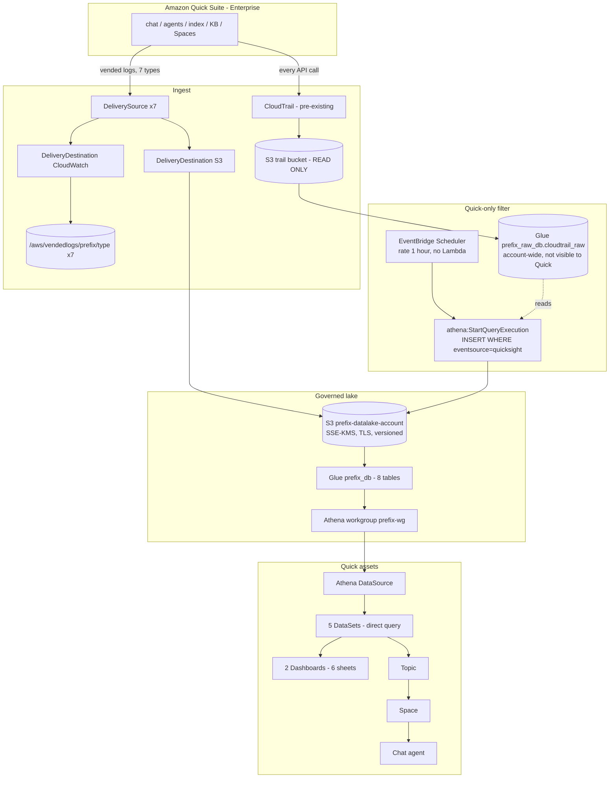
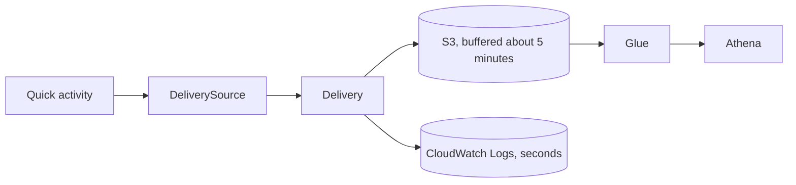
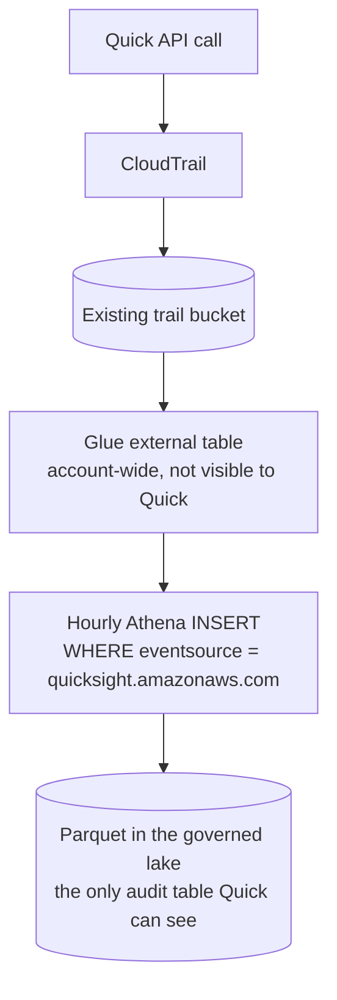

# Architecture: Amazon Quick Suite Observability

Enterprise observability for an Amazon Quick account. Quick's vended usage logs and its
CloudTrail API activity land in a governed S3 lake, are catalogued in AWS Glue, queried
through Amazon Athena, and surfaced as a Quick dashboard and a chat agent.

**Shape.** Fully serverless: event-driven ingest with a scheduled batch filter. There is no
compute in the data path, and therefore no Lambda function, Data Firehose stream, VPC or NAT
gateway to operate. The single Lambda function in the solution runs at deployment time only.

**Deployment.** The whole solution is defined in AWS CDK and deployed as two CloudFormation
stacks. Every account-specific input is supplied as configuration, so the same code deploys
to any account and Region without modification.

### Reading this document

Resource names in this document use placeholders that are resolved from configuration at
deployment time:

| Placeholder | Resolves to | Example |
|---|---|---|
| `<prefix>` | The resource name prefix for the deployment | `quick-obs` |
| `<account-id>`, `<account>` | The AWS account hosting the Quick account | A 12-digit account id |
| `<region>` | The Region the Quick account is enabled in | `us-east-1` |
| `<type>` | One of the seven vended log types | `chat_logs` |

Names starting `QUICK_OBS_` are configuration variables read at deployment time, and commands
shown as `npm run <name>` are operational scripts packaged with the solution.

---

## 1. Deployment diagram

The diagram below is the single definition of the deployment topology. It renders directly in
the repository, and the Word version of this document embeds an image generated from this same
source, so the two cannot diverge.

---

## 2. Components

| # | Component | Service | Purpose | Notes |
|---|---|---|---|---|
| 1 | Delivery source x7 | CloudWatch Logs | Registers the Quick account as a log producer, one per log type | One source per (account, log type), account-wide |
| 2 | Delivery destination x14 | CloudWatch Logs | S3 and CloudWatch targets | A single delivery source feeds both destinations |
| 3 | Delivery x14 | CloudWatch Logs | Binds source to destination | Hive-compatible S3 paths |
| 4 | Log groups x7 | CloudWatch Logs | Live tail and Logs Insights | Streams appear within seconds; S3 delivery buffers about 5 minutes. Optional |
| 5 | Lake bucket | S3 | Long-term store, Athena source | SSE-KMS with CMK, TLS enforced, versioned, all public access blocked, tiering at 90/365 days |
| 6 | CMK | KMS | Encrypts lake and log groups | Rotation on. Grants scoped by `aws:SourceAccount` + `aws:SourceArn` |
| 7 | Raw trail table | Glue | External table over the existing trail bucket | Account-wide. **Quick is granted nothing on this database or bucket** |
| 8 | Materialise schedule | EventBridge Scheduler | Hourly Quick-only filter | Universal target calls Athena directly. No Lambda |
| 9 | Audit table | Glue + S3 Parquet | Quick-only API events | Written by #8, deduplicated on read by `event_id` |
| 10 | Vended tables x7 | Glue | One per log type | Partition projection; OpenX JSON SerDe with case-insensitive mapping |
| 11 | Workgroup | Athena | Query isolation and result location | Results expire after 30 days |
| 12 | Quick data source | Quick | Athena connection | |
| 13 | Datasets x5 | Quick | Direct query, pre-joined | Direct query, not SPICE: no refresh schedule, no staleness |
| 14 | Dashboards x2 | Quick | Quick Pulse (adoption, answer quality, API audit) and Quick Observability (agent-hour cost, index storage, knowledge base sync), 3 sheets each | Authored in Quick and deployed verbatim from a captured definition |
| 15 | Topic | Quick | Semantic layer for natural language | Column synonyms, data roles and default aggregations, so questions resolve without pre-written queries |
| 16 | Space + agent | Quick | Grounded chat over the topic | Requires a Pro-role owner |
| 17 | Provisioner | Lambda | Sets topic and agent ownership at deployment time | Not in the data path |

---

## 3. Data flow

### Path A: vended usage logs, event-driven and near real time

**Coverage begins at configuration.** Vended log delivery captures events from the point it
is configured onward. A table therefore holds no rows until the corresponding Quick feature is
used, and remains empty for any feature the account does not use: `DLP_LOGS`, for example,
emits records only where a DLP provider is configured.

### Path B: API audit, scheduled batch and Quick-only by construction

**Filtering occurs once, at ingest.** A CloudTrail trail records activity for the whole
account, and its scope cannot be narrowed to a single service at the trail: management-event
selectors restrict `eventSource` by exclusion only, event data stores are queryable solely
through CloudTrail Lake and cannot back an Athena dataset, and CloudTrail objects interleave
services so S3-prefix scoping does not apply. Ingest is therefore the point at which the
filter is applied, and the filtered table is the only audit data Quick is granted.

**The window overlaps, and the dataset de-duplicates on read.** The filter processes a
three-hour window every hour, so a run that does not complete is covered by the next one.
`ROW_NUMBER() OVER (PARTITION BY event_id)` in the dataset keeps a single copy of each event.
The pipeline holds no state between runs, so any run can be repeated safely. The cost is
approximately threefold write amplification, in exchange for tolerating a two-hour
interruption with no loss of data and no operator intervention.

**This path includes history from the point of deployment**, because it reads a trail that is
already recording.

---

## 4. Security

| Control | Implementation |
|---|---|
| Encryption at rest | Customer-managed KMS key on the lake and all log groups. Bucket keys on for cost |
| Encryption in transit | `enforceSSL` denies any non-TLS request to the lake |
| Network exposure | None. No VPC, no endpoint, no public access. All public access blocked on the bucket |
| Least privilege, Quick | An inline policy on the Quick service role grants read access to `<prefix>_db` and the lake bucket only, and not to the raw database or the trail bucket. A synthesis-time assertion enforces the exclusion |
| Least privilege, filter | The materialise role is the only principal granted read access to the trail bucket |
| Sensitive content | Chat message bodies are excluded by default (`QUICK_OBS_LOG_SENSITIVE=false`), since the dashboard does not require message content |
| Delivery-path grants | Scoped by `aws:SourceAccount` and `aws:SourceArn` to this account's own delivery sources |
| Blast radius | Read-only on everything pre-existing. The trail and its bucket are never written to |

### What Quick can and cannot see

| | Quick service role |
|---|---|
| `<prefix>_db` (8 tables, Quick-only audit) | read |
| `<prefix>-datalake-<account>` | read |
| `<prefix>_raw_db` (account-wide CloudTrail) | **no access** |
| existing trail bucket | **no access** |

The Quick-visible audit table contains a single `event_source`, `quicksight.amazonaws.com`.
The Quick service role holds no grant referencing the trail bucket, and a synthesis-time
assertion fails the build if such a grant is introduced.

---

## 5. Reliability and correctness controls

The solution carries the following controls. Each is enforced by the code rather than by
convention, so a configuration that would violate one fails at synthesis or deployment time
rather than producing a running system with incorrect data.

| Control | Enforcement |
|---|---|
| Region is explicit | `QUICK_OBS_REGION` is the single source of the target Region. Ambient region variables are ignored, so preflight validation and deployment always resolve the same Region |
| Materialise window exceeds the schedule | A synthesis-time assertion requires the lookback to be at least twice the schedule interval, so a run that does not complete is always covered by the next one |
| Storage formats are separated | The Parquet audit prefix is distinct from the JSON vended-log prefixes, so each Glue table reads a single format |
| Delivery sources are checked before deployment | Preflight confirms that no delivery source already exists for the account and log type, since these are account-level singletons |
| Topic changes are explicit | `QUICK_OBS_TOPIC_REVISION` participates in the topic identifier and the construct identifier, so a change to the topic is a deliberate, reviewable replacement |
| Datasets declare their dependencies | Each dataset declares the Glue tables it reads. Narrowing `QUICK_OBS_LOG_TYPES` removes the datasets and visuals that are no longer supported, rather than leaving references to tables that do not exist |
| Column contracts are validated | Every declared dataset column is checked against the query that produces it, and every dashboard field is generated from the column's declared type |
| Timestamps are unit-independent | Event timestamps are converted by detecting the epoch unit from magnitude, so both second and millisecond sources resolve correctly |

### Verifying an operational deployment

Delivery configuration and delivered data are separate conditions, and both are worth
confirming:

| Check | Command |
|---|---|
| Delivery configuration | `aws logs describe-deliveries` returns 14 deliveries: 7 log types to 2 destinations each |
| Delivered data | An object listing under the lake bucket's log-type prefix |
| Scheduled filter | The `AWS/Scheduler` namespace: `InvocationAttemptCount` increasing, with `TargetErrorCount` and `InvocationDroppedCount` at zero |
| Query success | Athena query history for the workgroup, with `Status.State` and `DataScannedInBytes` per run |
| Data currency | `SELECT MAX(event_time)` per table |

Two operational scripts packaged with the solution perform this work: `npm run verify` runs
every check above and reports the result per table, and `npm run query` provides 11 named
queries over the same data for ad hoc inspection. Both read the same configuration as the
deployment, so they require no separate credentials or endpoints.

---

---

## 6. Cost

The architecture keeps recurring cost low by design: there is no always-on compute, so nothing
is billed unless Quick activity occurred or someone opened the dashboard. At the volumes this
solution produces, cost is driven by **query count and a fixed key charge**, not by data
volume.

### Measured volumes

Taken from a deployed account after three days of operation, including a batch of test chat
traffic:

| Store | Size | Objects |
|---|---|---|
| Vended logs in S3, all seven types | 40 KB | 56 |
| Quick-only audit table, Parquet | 1.2 MB | 107 |
| Athena query results, 30-day expiry | 4.3 MB | 4,275 |
| **Lake total** | **5.6 MB** | **4,445** |
| CloudWatch log groups, seven, 90-day retention | 172 KB | n/a |

Two observations matter more than the totals. Telemetry volume is negligible: seven log types
across three days produced 40 KB. And the object count is concentrated in Athena query results
rather than in the data itself, because every query writes a result object. Query count, not
stored bytes, is therefore the cost driver to watch.

### Monthly cost model

Rates below are published us-east-1 on-demand rates. They are indicative rather than
contractual; use the AWS Pricing Calculator for a binding figure, and confirm current rates,
since these change.

| Component | What drives the charge | At the volumes above |
|---|---|---|
| AWS KMS | One customer-managed key, charged monthly, plus request charges. S3 Bucket Keys are enabled, which amortises requests per bucket rather than per object | Approximately $1, and the largest single line item |
| Amazon Athena | Data scanned, at a 10 MB minimum per query. The hourly filter runs 720 times a month and scans about 10 MB each time. Dashboard views add one query per visual | Around $0.05 for the filter. Dashboard use is additive and depends on viewer numbers |
| Amazon S3 | Storage is trivial at these volumes. Requests are the larger term: `PUT` for each delivered log object, each Parquet write and each query result | Cents |
| CloudWatch Logs | Vended log delivery is charged per GB delivered, at volume-tiered rates, plus storage for the optional log groups | Cents at 172 KB. Omit the log groups entirely to remove this line |
| AWS Glue Data Catalog | Objects stored and requests made. Nine tables and normal query traffic sit inside the monthly free allowance | Effectively zero |
| EventBridge Scheduler | 720 invocations a month | Effectively zero |
| AWS Lambda | Runs at deployment time only, not in the data path | Effectively zero |

**Indicative total: under $5 per month** at the observed volume, of which the KMS key is the
largest component. The pipeline itself costs less to run than the key that encrypts it.

### Projected cost at 10,000 Quick users

Two different populations drive cost, and separating them is the whole point of this
projection:

- **Quick Suite users** generate telemetry. They drive log volume and storage.
- **Dashboard and agent users** consume it. They drive Athena query volume.

These are rarely the same number. An account with 10,000 Quick users is typically observed by
an administrative audience of tens, not thousands. The projection below shows why that
distinction matters more than the user count itself.

#### Assumptions

Substitute your own figures; the model is linear in each.

| Assumption | Value |
|---|---|
| Quick Suite users | 10,000 |
| Working days per month | 22 |
| Chat turns per user per day | 10 |
| Proportion of answers rated | 20% |
| Chat sessions per user per day | 2 |
| Quick API calls per session | 5 |
| Metered agent-hour rows per user per day | 2 |
| Write amplification before de-duplication | 3x, measured |

Per-record sizes are measured from the deployed account rather than assumed: 150 bytes per
chat turn, 116 per rating, 61 per metering row and 81 per stored audit row, all after
compression.

#### Resulting monthly volumes

| Quantity | Volume |
|---|---|
| Chat turns | 2,200,000 |
| Answer ratings | 440,000 |
| Agent-hour metering rows | 440,000 |
| Quick API events, distinct | 2,200,000 |
| Quick API events, stored before de-duplication | 6,600,000 |
| Vended logs written | 0.39 GB |
| Audit table written | 0.50 GB |
| **New data per month** | **0.89 GB** |

**Telemetry from 10,000 users is under 1 GB a month.** Storage, delivery and request charges on
that volume remain in single-digit dollars. The ingest half of this architecture does not
become expensive at 10,000 users.

#### Cost by consumption profile

Everything scales with the number of Athena queries, and direct query issues one query per
visual per dashboard view, each billed at a 10 MB minimum. At this data volume a query scans
approximately 100 MB.

| Profile | Athena queries per month | Athena | Everything else | Indicative total |
|---|---|---|---|---|
| Ingest only, no dashboard use | 720 (the hourly filter) | $0.35 | ~$4 | **~$4 / month** |
| 25 administrators, twice daily | 33,000 | $16 | ~$6 | **~$22 / month** |
| 100 administrators, twice daily | 132,000 | $63 | ~$10 | **~$73 / month** |
| 1,000 users, once daily | 660,000 | $315 | ~$30 | **~$345 / month** |

"Everything else" covers the KMS key at approximately $1, S3 storage and requests, vended log
delivery, and CloudWatch log group storage. It grows with request volume rather than with data
volume.

#### The decision this projection surfaces

Cost is governed by how widely the dashboard is read, not by how many people use Quick. Up to
roughly 100 regular dashboard users, direct query remains the better trade: no ingestion
schedule, no staleness, and a bill in tens of dollars.

Past that point, move the five datasets to SPICE. SPICE capacity is priced per GB-month, the
datasets here total single-digit gigabytes, and refreshing on a schedule replaces hundreds of
thousands of per-view queries with a fixed handful per day. The cost then stops tracking
viewer numbers altogether, at the price of the dashboard being as current as the last refresh
rather than current at the moment it is opened. The datasets are defined in one place, so this
is a configuration change rather than a redesign.

Three further levers, in the order worth pulling:

1. **Narrow `QUICK_OBS_LOG_TYPES`** to the log types actually reported on. Each type removed
   takes its table, delivery, storage and query load with it.
2. **Disable the CloudWatch log groups.** They exist for live tailing during a deployment and
   duplicate what is already in S3.
3. **Lengthen the filter interval** from hourly. The lookback floor requires the window to be
   at least twice the interval, so a two-hour schedule with a four-hour window halves the
   filter's query count while keeping the same tolerance for a missed run.

### What this excludes

**Amazon Quick Suite licensing is not included and will dominate the total.** Author Pro and
Reader Pro roles are priced above their non-Pro equivalents, and Spaces and knowledge bases
consume Quick Index storage capacity. That cost is a property of the Quick account being
observed rather than of this solution, and it exists whether or not this solution is deployed.

Also excluded: the CloudTrail trail, which is assumed to exist already and is read without
modification, and the AWS support plan.

### A note on trail volume

The hourly filter scans the CloudTrail partitions for the last two days, so its cost tracks
total account activity rather than Quick activity alone. A busier account scans more, which is
why the date predicates are always applied and why the filter runs against partitioned data.
At the volumes projected above this term stays under a dollar a month.

## 7. Design characteristics

Two properties of the architecture are worth stating explicitly, because both differ from the
most common way of assembling the same capability.

### Vended log delivery direct to S3

Vended logs are delivered to Amazon S3 through CloudWatch Logs delivery:
`DeliverySource` to `DeliveryDestination` to `Delivery`. S3 is a first-class delivery
destination, and a single delivery source feeds multiple destinations, so one source per log
type supports both the S3 analytics path and the CloudWatch Logs live-tail path.

This removes the streaming and transform tier that a subscription-filter design requires,
which at seven log types is approximately 35 fewer resources and no custom code in the data
path. Record shaping is declarative instead, through Glue SerDe column mapping and dataset
SQL.

### A semantic layer for natural language, rather than query tools

The chat agent is grounded on a Quick topic over the Athena datasets. Each column declares a
business-friendly name, description, synonyms, a data role and, for measures, a default
aggregation. Topic-level custom instructions state the conventions a reader would otherwise
have to infer, such as which measure represents billable cost and how unrated feedback should
be treated.

Because answers derive from declared column semantics, the agent covers both the questions
the dashboard was designed around and questions that were not anticipated, with no
per-question configuration. The whole semantic layer is defined in code and deploys with the
rest of the solution, requiring no console configuration, no gateway and no credentials to
distribute. The solution also packages 11 named queries that provide a command-line
path over the same datasets.
